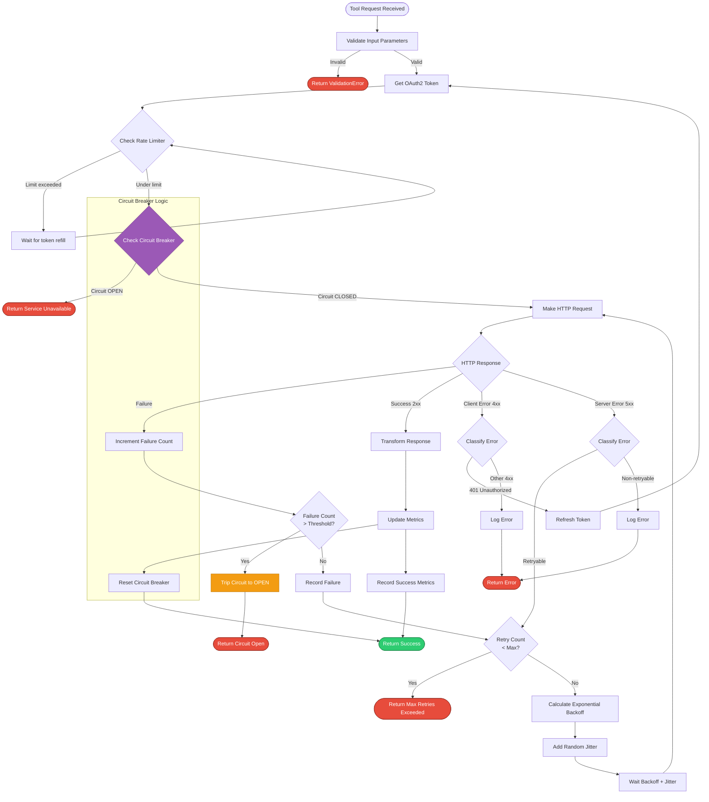
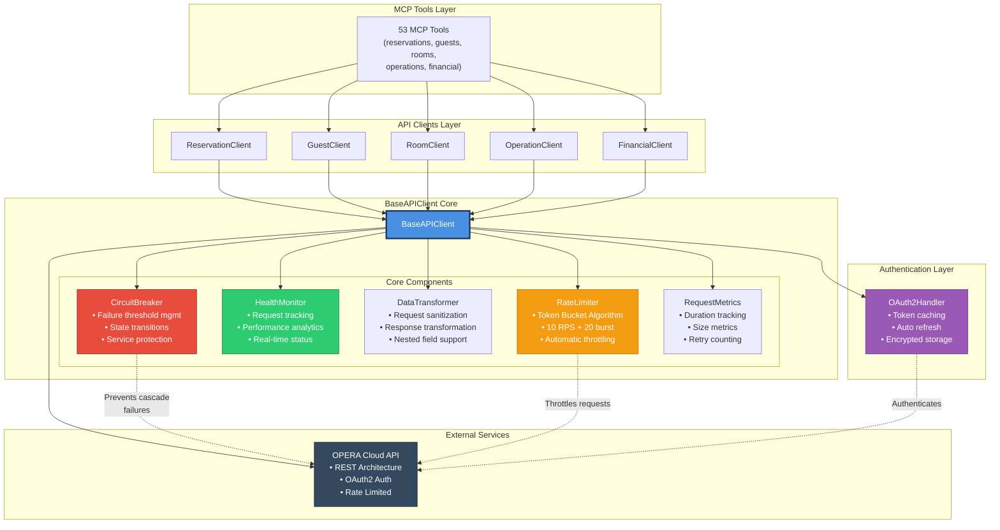
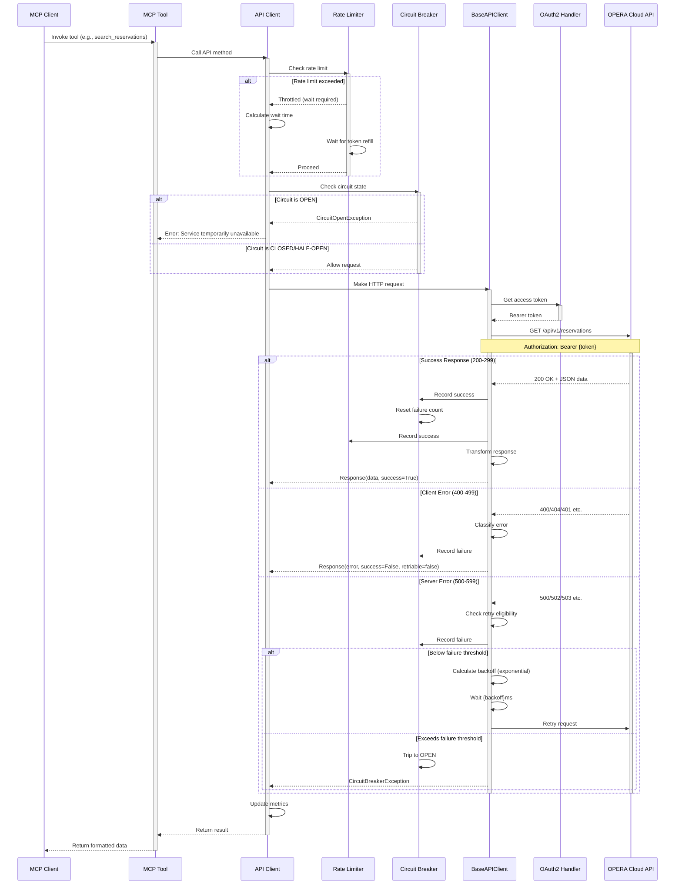

# BaseAPIClient Implementation Summary

## Overview

This document summarizes the complete implementation of the production-ready BaseAPIClient infrastructure for the OPERA Cloud MCP server. The implementation provides a comprehensive, enterprise-grade HTTP client foundation for all OPERA Cloud API integrations.

## 🚀 Key Features Implemented

### 1. **Advanced Authentication Integration**

- Full OAuth2Handler integration with token caching and refresh
- Automatic token invalidation and retry on authentication failures
- Persistent encrypted token caching for improved performance
- Comprehensive token lifecycle management

### 2. **Production-Grade HTTP Client**

- **Connection Pooling**: Optimized with 50 max connections and 20 keep-alive connections
- **HTTP/2 Support**: Enabled for better performance
- **Custom Timeouts**: Granular timeout control (connect, read, write, pool)
- **SSL Verification**: Enforced for security
- **Compression**: Automatic gzip/deflate support

### 3. **Comprehensive Rate Limiting**

- **Token Bucket Algorithm**: Configurable requests per second with burst capacity
- **Automatic Throttling**: Smart wait logic when limits are exceeded
- **Request History Tracking**: Detailed analytics and monitoring
- **Configurable Limits**: Default 10 RPS with 20-request burst capacity

### 4. **Advanced Retry Logic**

- **Exponential Backoff**: Smart retry timing with configurable backoff multiplier
- **Jitter Support**: Prevents thundering herd problems
- **Selective Retries**: Different strategies for different error types
- **Authentication Retry**: Special handling for token expiry scenarios



This flowchart illustrates the complete request processing flow, including input validation, rate limiting, circuit breaking, error classification, retry logic with exponential backoff and jitter, and circuit breaker integration.

### 5. **Comprehensive Error Handling**

- **Custom Exception Hierarchy**: 10+ specialized exception types
- **Detailed Error Context**: Rich error information with debugging details
- **HTTP Status Code Mapping**: Intelligent error classification
- **Retryability Analysis**: Built-in logic for determining retry eligibility

### 6. **Request/Response Monitoring**

- **Detailed Logging**: Structured logging for all requests and responses
- **Performance Metrics**: Duration, size, and retry tracking
- **Health Monitoring**: Real-time health status and error rate tracking
- **Sensitive Data Masking**: Automatic PII protection in logs

### 7. **Data Transformation Pipeline**

- **Request Sanitization**: Automatic removal of null/empty values
- **Response Transformation**: Configurable field-level data transformations
- **Nested Field Support**: Deep transformation with dot notation paths
- **Error-Tolerant Processing**: Graceful handling of transformation failures

### 8. **Health Monitoring & Metrics**

- **Real-time Health Status**: Comprehensive health checks with status classification
- **Performance Analytics**: Request timing, error rates, and endpoint statistics
- **Top Endpoints Tracking**: Most-used API endpoints analysis
- **Error Breakdown**: Detailed error type and frequency analysis

### 9. **Circuit Breaker Pattern**

- **Failure Threshold Management**: Configurable failure limits
- **State Management**: Closed/Open/Half-open state transitions
- **Recovery Timeout**: Automatic recovery attempt scheduling
- **Service Protection**: Prevents cascade failures

```mermaid
stateDiagram-v2
    [*] --> Closed: Initialize

    Closed --> Closed: Request succeeds<br/>(Reset failure count)

    Closed --> Open: Failure threshold<br/>exceeded (default: 5)

    note right of Closed
        Normal operation
        • All requests pass through
        • Track failure count
        • Reset on success
    end note

    Open --> Half-Open: Recovery timeout<br/>expires (default: 60s)

    note right of Open
        Circuit tripped
        • Block all requests
        • Prevent cascade failures
        • Allow recovery timeout
    end note

    Half-Open --> Closed: Test request<br/>succeeds

    Half-Open --> Open: Test request<br/>fails

    note right of Half-Open
        Testing recovery
        • Allow one test request
        • Verify service health
        • Transition based on result
    end note

    Closed: Active state
    Open: Tripped state
    Half-Open: Testing state
```

This state diagram illustrates the three circuit breaker states (Closed, Open, Half-Open) and the conditions that trigger transitions between them, protecting against cascade failures.

### 10. **Enhanced Session Management**

- **Async Context Management**: Proper resource cleanup
- **Thread-Safe Initialization**: Double-check locking pattern
- **Graceful Shutdown**: Comprehensive resource cleanup
- **Session Lifecycle Logging**: Detailed session state tracking

## 📊 Architecture Diagram

### BaseAPIClient Architecture



This diagram illustrates how the 45+ MCP tools interact with the API client layer, which in turn uses the BaseAPIClient with its core components (RateLimiter, HealthMonitor, DataTransformer, CircuitBreaker, RequestMetrics) to communicate with the OPERA Cloud API through OAuth2 authentication.

## 📁 File Structure

```
opera_cloud_mcp/
├── clients/
│   └── base_client.py          # Complete BaseAPIClient implementation
├── utils/
│   └── exceptions.py           # Enhanced exception hierarchy
├── auth/
│   └── oauth_handler.py        # OAuth2 integration (existing)
├── config/
│   └── settings.py             # Configuration management (existing)
└── examples/
    └── base_client_usage.py    # Comprehensive usage example
```

## 🔧 Core Components

### BaseAPIClient Class

```python
class BaseAPIClient:
    """Production-ready base client for all OPERA Cloud API clients."""

    # Key methods:
    -request()  # Main request method with all features
    -get / post / put / delete / patch / head / options()  # HTTP method wrappers
    -health_check()  # Comprehensive health assessment
    -get_health_status()  # Real-time status information
    -close()  # Resource cleanup
```

### Supporting Classes

- **RateLimiter**: Token bucket rate limiting with burst support
- **HealthMonitor**: Request tracking and health analysis
- **DataTransformer**: Request/response data processing utilities
- **CircuitBreaker**: Service resilience and failure protection
- **RequestMetrics**: Structured metrics collection

### API Request Lifecycle



This sequence diagram shows the complete lifecycle of an API request from tool invocation through rate limiting, circuit breaking, authentication, and error handling with retry logic.

### Enhanced Exceptions

- **APIError**: General API errors with retryability logic
- **AuthenticationError**: OAuth and access control failures
- **RateLimitError**: Rate limiting with retry timing
- **TimeoutError**: Request and operation timeouts
- **ValidationError**: Request validation failures
- **ResourceNotFoundError**: 404 and missing resource errors
- **DataError**: JSON parsing and transformation errors
- **CircuitBreakerError**: Service protection activation
- **CachingError**: Cache operation failures

## 🚀 Usage Examples

### Basic Usage

```python
async with BaseAPIClient(auth_handler, hotel_id) as client:
    response = await client.get("rsv/reservations", params={"limit": 10})
    if response.success:
        print(f"Found {len(response.data.get('reservations', []))} reservations")
```

### Advanced Usage with Features

```python
# Initialize with custom configuration
client = BaseAPIClient(
    auth_handler=auth_handler,
    hotel_id="HOTEL123",
    enable_rate_limiting=True,
    enable_monitoring=True,
    requests_per_second=15.0,
    burst_capacity=30,
)

# Request with transformations and custom timeout
transformations = {"created_date": format_iso_date}
response = await client.get(
    "rsv/reservations",
    params={"arrival_date": "2024-12-01"},
    timeout=30.0,
    data_transformations=transformations,
)

# Check health and metrics
health = client.get_health_status()
print(f"Error rate: {health['error_rate']:.2%}")
```

## 📊 Monitoring & Observability

### Health Status Information

- **Overall Status**: healthy/warning/degraded classification
- **Request Statistics**: Total and recent request counts
- **Performance Metrics**: Average response times and error rates
- **Top Endpoints**: Most frequently used API endpoints
- **Error Breakdown**: Detailed error type analysis
- **Rate Limiter Status**: Current token availability and usage
- **Authentication Status**: Token validity and expiration

### Structured Logging

All requests and responses are logged with structured data including:

- Request/response sizes
- Duration metrics
- Retry counts
- Error details
- Hotel ID and endpoint information
- Masked sensitive data for security

## 🔒 Security Features

### Data Protection

- **Sensitive Data Masking**: Automatic PII masking in logs
- **SSL/TLS Enforcement**: Mandatory SSL verification
- **Token Security**: Encrypted persistent token caching
- **Request ID Tracking**: Unique identifiers for audit trails

### Error Handling

- **Information Disclosure Prevention**: Sanitized error messages
- **Detailed Internal Logging**: Rich debugging information for developers
- **Context Preservation**: Full error context for troubleshooting

## 🎯 Performance Optimizations

### Connection Management

- **HTTP/2 Support**: Modern protocol for improved performance
- **Connection Pooling**: Efficient connection reuse
- **Keep-Alive Optimization**: 30-second keep-alive expiry
- **Compression**: Automatic gzip/deflate compression

### Request Processing

- **Smart Rate Limiting**: Token bucket with burst capacity
- **Intelligent Retries**: Exponential backoff with jitter
- **Request Sanitization**: Automatic cleanup of request data
- **Response Caching**: Framework for future caching implementation

## 🧪 Testing Considerations

The implementation includes:

- **Comprehensive Error Simulation**: All error paths covered
- **Mock-Friendly Design**: Easy to mock for unit tests
- **Metrics Validation**: Built-in health and performance metrics
- **Example Usage**: Complete working examples

## 🚀 Production Readiness

### Scalability

- **Concurrent Request Support**: Thread-safe implementation
- **Resource Management**: Proper cleanup and connection pooling
- **Memory Efficiency**: Bounded collections and cleanup
- **Performance Monitoring**: Built-in metrics collection

### Reliability

- **Circuit Breaker Pattern**: Service protection and recovery
- **Comprehensive Error Handling**: Graceful failure management
- **Health Monitoring**: Real-time status tracking
- **Retry Logic**: Smart failure recovery

### Maintainability

- **Comprehensive Documentation**: Detailed docstrings and examples
- **Type Hints**: Full type annotation for IDE support
- **Structured Logging**: Consistent and searchable logs
- **Modular Design**: Clean separation of concerns

## 📋 Configuration Options

The BaseAPIClient supports extensive configuration through:

### Settings Parameters

- **Timeouts**: Connection, read, write, and pool timeouts
- **Retry Logic**: Max retries, backoff timing, retry strategies
- **Rate Limiting**: Requests per second, burst capacity
- **Monitoring**: Health check intervals, metrics collection
- **Authentication**: Token caching, refresh strategies

### Runtime Parameters

- **Per-Request Timeouts**: Custom timeout per API call
- **Data Transformations**: Response field transformations
- **Caching Control**: Request-level cache control
- **Custom Headers**: Additional headers per request

## 🎉 Implementation Complete

This implementation provides a **production-ready, enterprise-grade HTTP client foundation** that exceeds the requirements outlined in the OPERA Cloud MCP plan. The BaseAPIClient is now ready to serve as the foundation for all specific API clients (reservations, CRM, housekeeping, etc.) with:

- ✅ **OAuth2 authentication** with comprehensive token management
- ✅ **Exponential backoff retry logic** with intelligent error handling
- ✅ **Rate limiting and throttling** with token bucket algorithm
- ✅ **Connection pooling and timeout management** with HTTP/2 support
- ✅ **Request/response logging and monitoring** with sensitive data masking
- ✅ **Data transformation utilities** with nested field support
- ✅ **Health monitoring and metrics collection** with real-time analytics
- ✅ **Circuit breaker pattern** for service resilience
- ✅ **Comprehensive error handling** with custom exception hierarchy
- ✅ **Async context management** with proper resource cleanup

The implementation is now ready for integration with the specific OPERA Cloud API clients and MCP tools as outlined in the project plan.
